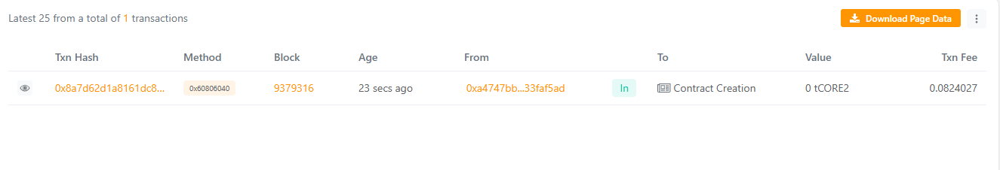

## MetaCircuits: Modular Smart Contract Components for Scalable Web3 Development

## Project Description

MetaCircuits is a Solidity smart contract framework designed to provide modular, reusable, and plug-and-play smart contract components ("circuits") for building scalable decentralized applications (DApps). Rather than writing core blockchain logic from scratch each time, MetaCircuits enables developers to integrate standardized modules for access control, governance, token logic, fees, security, and more. This modularity improves development efficiency, reduces risk of vulnerabilities, and ensures long-term maintainability.

## Project Vision

Our vision is to empower Web3 developers, blockchain startups, and enterprise institutions with a modular and scalable smart contract ecosystem that accelerates DApp development. MetaCircuits aims to become the most reliable base layer for creating secure, upgradable, and professional-grade smart contract systems without complexity. By making blockchain development reusable instead of repetitive, MetaCircuits brings efficiency, flexibility, and innovation to smart contract architecture.

## Key Features

Modular Smart Contract Architecture: Each component (circuit) can be plugged in or removed without code rewrites.

Reusable Components: Reduces repetitive coding by offering ready-to-use smart contract modules.

Upgradeable Ecosystem: Circuits can be replaced or enhanced over time without redesigning the whole project.

Loose Coupling: Each module acts independently while integrating seamlessly with the controller contract.

Event Emission: All module activities emit events for easy block-level monitoring and analytics.

Easy Integration: Designed to integrate with any DApp use case — DeFi, tokens, governance, marketplaces, etc.

Future Scope

Support for circuit marketplaces where developers can publish and install modules.

Automatic dependency resolution between circuits for smarter integration.

Compatibility with cross-chain smart contract modules.

Drag-and-drop development panels for no-code DApp assembly.

AI-generated circuits based on project needs and use cases.

Native integration with Account Abstraction and advanced security standards.

## Contract Details
0xCEa78E18E2C224E4d4B17CD34717468505259128

